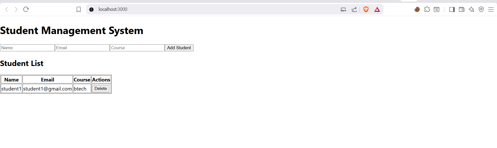
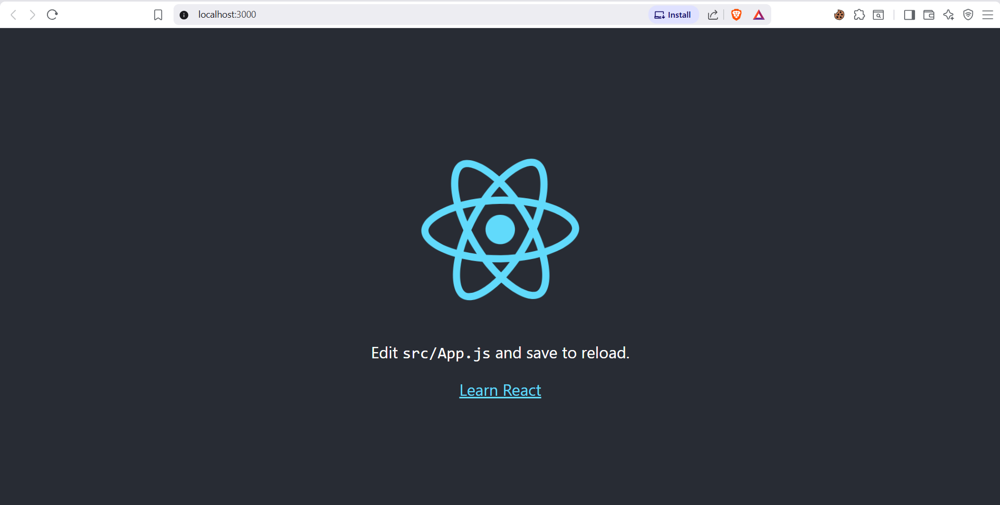
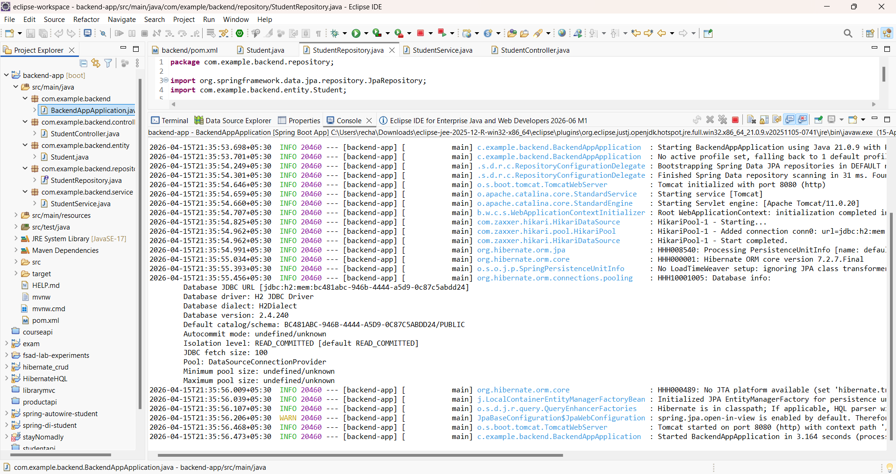
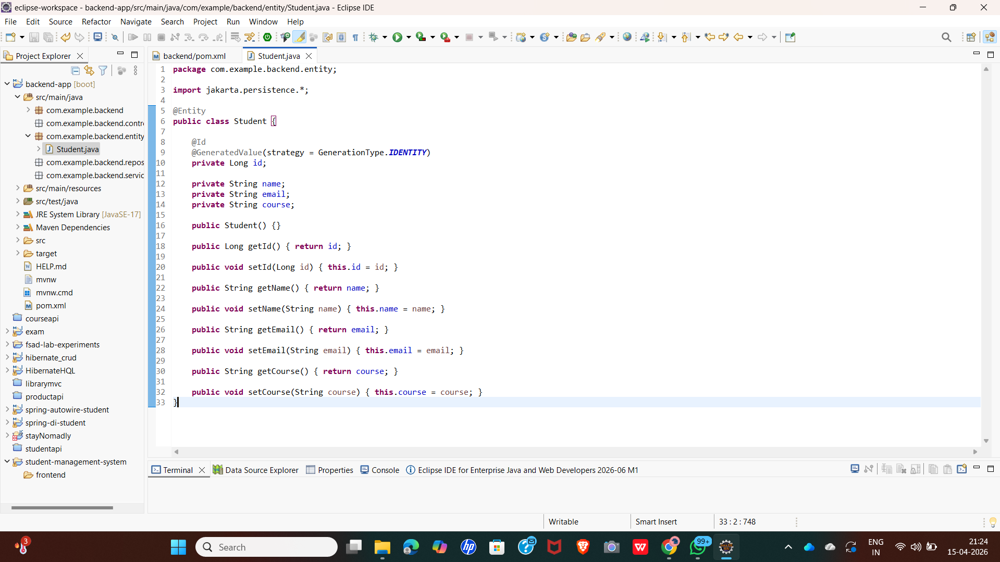
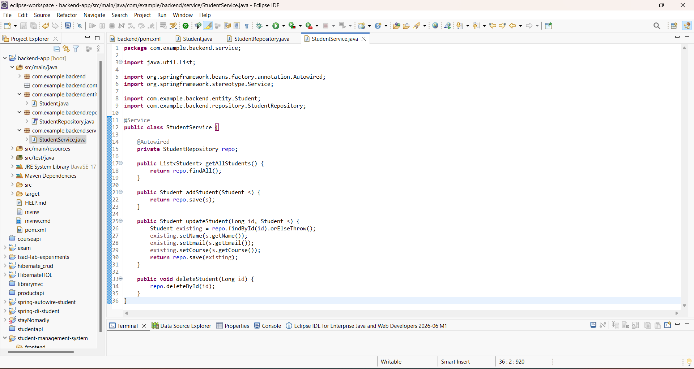
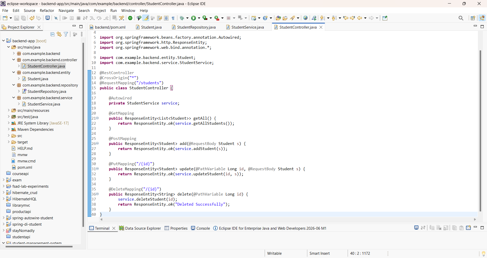
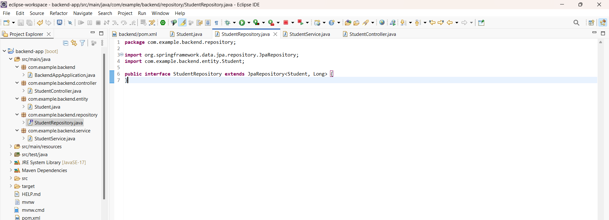

# 🎓 Student Management System

A full-stack **Student Management System** built using **Spring Boot (Backend)** and **React (Frontend)** that performs complete CRUD operations.

---

## 🚀 Features

* ➕ Add Student
* 📋 View Students
* ❌ Delete Student
* 🔄 Real-time UI updates
* 🔗 REST API integration

---

## 🛠️ Tech Stack

### 🔹 Backend

* Java
* Spring Boot
* Spring Data JPA
* H2 Database
* Maven

### 🔹 Frontend

* React.js
* Axios
* HTML, CSS, JavaScript

---

## 📂 Project Structure

```id="a1b2c3"
student-management-system/
├── backend-app/
├── frontend/
└── screenshots/
```

---

## ⚙️ How to Run

### 🔹 Backend

1. Open in Eclipse
2. Run:

```id="b2c3d4"
BackendAppApplication.java
```

Runs at:

```id="c3d4e5"
http://localhost:8080
```

---

### 🔹 Frontend

```id="d4e5f6"
cd frontend
npm install
npm start
```

Runs at:

```id="e5f6g7"
http://localhost:3000
```

---

## 🔗 API Endpoints

| Method | Endpoint       | Description      |
| ------ | -------------- | ---------------- |
| GET    | /students      | Get all students |
| POST   | /students      | Add student      |
| DELETE | /students/{id} | Delete student   |

---

## 📸 Screenshots

### 🔹 Frontend UI



---

### 🔹 React Running



---

### 🔹 Backend Running



---

### 🔹 Entity (Student.java)



---

### 🔹 Service Layer



---

### 🔹 Controller Layer



---

### 🔹 Repository Layer



---

## 🧠 How It Works

1. React frontend sends requests using Axios
2. Spring Boot backend processes requests
3. Data stored in database
4. UI updates instantly

---

## 👩‍💻 Author

**Rebeka Meda**
**Registration Number: 2400032563**

---

## ⭐ Conclusion

This project demonstrates a complete **Full Stack CRUD Application** with seamless integration between frontend and backend.

---
